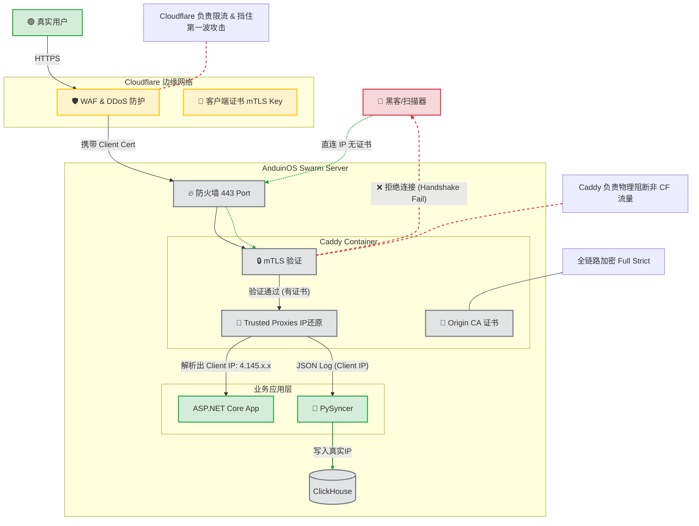

# AnduinOS Swarm


This is the docker swarm setup for AnduinOS.

这是一个容器唤起系统，能够一键配置并运行 AnduinOS 相关的服务。它基于 Cloudflare + Caddy + Docker Swarm + Py_Syncer + ClickHouse + ASP.NET Core 技术栈。

## 上 Cloudflare

上 Cloudflare 其实很简单。只需要亿步即可完成：

* 注册cloudflare
* 让cloudflare管理域名
* 让业务域名设置到真实IP上
* 删除caddy侧的限流。让cloudflare去处理限流。
* 让caddy信任cloudflare的IP作为代理。开发插件下载cloudflare ip来信任它们。
* 下载cloudflare的origin server证书到caddy，让caddy返回cloudflare的证书。这样外部如果不小心连上了我的caddy就会红。
* 在cloudflare TLS overview那里，改为 Current encryption mode: Full (strict)。这样强制cloudflare只信任这张证书。
* 增加caddy规则来禁止非cloudflare请求。下载cloudflare的公钥并要求mtls验证。开启：Authenticated Origin Pulls。实现黑客完全无法在override hostname+ip的情况下请求服务器。
* 让caddy把请求转发给业务应用的时候，取cloudflare的IP发给业务应用，并进行日志。优雅的处理cloudflare的ip。
* py_syncer去消费client ip而不是remote_ip，从而在日志和统计中出现真实的IP。



Cloudflare 需要管理的设置：

* DNS -> Settings -> DNS SEC -> On
* Security -> Settings -> Bot Fight Mode -> On
* Security -> Settings -> AI Labyrinth -> On
* Secuirty -> Settings -> Browser integrity check -> On
* SSL/TLS -> Current encryption mode -> Full **Strict**
* SSL/TLS -> Edge Certificates -> HSTS -> On
* SSL/TLS -> Edge Certificates -> Minimum TLS Version -> 1.2
* SSL/TLS -> Edge Certificates -> Always Use HTTPS -> On
* SSL/TLS -> Origin Server -> Authenticated Origin Pulls -> On
* Speed -> Settings -> Protocol Optimization -> HTTP3 -> On
* Speed -> Settings -> Protocol Optimization -> 0-RTT Connection Resumption -> On
* Speed -> Settings -> Content Optimization -> Rocket Loader -> Off
* Account -> Analytics & Logs -> Web analytics -> Manage site -> Advanced -> Delete
* Caching -> Tiered Cache -> Smart
* Caching -> Cache Rules -> Create rule -> Cache default file extensions -> Deploy
* Caching -> Configuration -> Crawler Hints
* Network -> IPv6 Compatibility -> On
* Network -> WebSockets -> On
* Network -> IP Geolocation -> On
* Scrape Shield -> Email Address Obfuscation -> On

折腾 Cloudflare 的设置的同时，我们也要对应调整好 Caddy。

## Caddy 的配置

首先编译 Caddy 的时候，大概流程如下：

* 先编译二进制
* 再生成配置文件。配置文件分三步：
  * cloudflare 的IP表
  * 基准区
  * 业务代码区
* 再生成一个假证书，方便caddy去验证。
* 最后把真证书（Cloudflare下发的）分给Caddy。

Caddy **放弃** 办理HTTPS证书！！但是仍然开启HTTPS，使用Cloudflare的证书！

Caddy **无法被非Cloudflare访问**！Caddy 强制客户端 mTLS！Caddy每次请求都要验证 Cloudflre 的证书！

Caddy **只信任Cloudflare** 作为前置代理！

```Dockerfile
# ============================
# Prepare caddy Environment
FROM localhost:8080/public_mirror/caddy:builder AS caddy-build-env

RUN xcaddy build \
    --with github.com/ueffel/caddy-brotli \
    --with github.com/caddyserver/transform-encoder

# ============================
# Prepare Caddyfile build Environment
FROM localhost:8080/box_starting/local_ubuntu AS config-build-env
WORKDIR /app

# Install curl for fetching Cloudflare IPs and openssl for generating dummy certs
# Also download Cloudflare Origin Pull CA certificate for mTLS verification
RUN apt-get update && \
    apt-get install -y curl openssl ca-certificates && \
    mkdir -p /app/Dist/certs && \
    curl -fsSL -o /app/Dist/certs/origin-pull-ca.pem https://developers.cloudflare.com/ssl/static/authenticated_origin_pull_ca.pem && \
    rm -rf /var/lib/apt/lists/*

COPY . .

# Outputs to /app/Dist/Caddyfile
RUN chmod +x /app/build_proxy.sh
RUN /bin/bash /app/build_proxy.sh

# Generate dummy certificates for build-time validation
# These will be replaced by real certificates at runtime via Docker volumes
RUN openssl req -x509 -newkey rsa:2048 -nodes \
    -keyout /app/Dist/certs/anduinos.key \
    -out /app/Dist/certs/anduinos.pem \
    -days 1 -subj "/CN=localhost"

# ============================
# Prepare Runtime Environment
FROM localhost:8080/public_mirror/caddy:latest

WORKDIR /app

EXPOSE 80 443

COPY --from=caddy-build-env /usr/bin/caddy /usr/bin/caddy
COPY --from=config-build-env /app/Dist/Caddyfile /etc/caddy/Caddyfile

# Copy dummy certificates to expected location for validation
# Note: These will be replaced by real certificates at runtime via Docker volumes
COPY --from=config-build-env /app/Dist/certs/anduinos.pem /data/caddy/certs/anduinos.pem
COPY --from=config-build-env /app/Dist/certs/anduinos.key /data/caddy/certs/anduinos.key

# Copy Cloudflare Origin Pull CA certificate to /etc/caddy (safe from volume mount)
COPY --from=config-build-env /app/Dist/certs/origin-pull-ca.pem /etc/caddy/origin-pull-ca.pem

# Now we can safely validate the Caddyfile with dummy certificates in place
RUN caddy validate --config /etc/caddy/Caddyfile --adapter caddyfile && \
    mkdir -p /var/log/caddy /data/caddy/logs && \
    touch /data/caddy/logs/web.log

ENTRYPOINT ["sh", "-c", "caddy run --config /etc/caddy/Caddyfile --adapter caddyfile & tail -f /data/caddy/logs/web.log & wait"]
```

上面的Dockerfile先不要立刻编译。有大量的东西我还没解释。

显然，

```bash
apt-get update && \
apt-get install -y curl openssl ca-certificates && \
mkdir -p /app/Dist/certs && \
curl -fsSL -o /app/Dist/certs/origin-pull-ca.pem https://developers.cloudflare.com/ssl/static/authenticated_origin_pull_ca.pem && \
rm -rf /var/lib/apt/lists/*
```

是为了下载 Cloudflare 的证书。这是一张公钥，Cloudflare 每次请求的时候，会使用他的私钥加密数据。这可以使得 Caddy 强制作为 Cloudflare 的傀儡。

过程：`/app/build_proxy.sh`非常复杂，内部分三步。

```bash
#!/bin/bash
set -e

echo "Building Caddyfile at $(pwd)..."
mkdir -p ./Dist

echo "Fetching Cloudflare IP ranges..."
chmod +x ./fetch_cloudflare_ips.sh
./fetch_cloudflare_ips.sh

echo "Adding empty lines to the end of files without a newline..."
find . -type f -name '*.conf' ! -name 'cloudflare_ips.conf' | while read -r file; do
    last_line=$(tail -n 1 "$file")
    if [[ -n "$last_line" ]]; then
        echo "" >> "$file"
        echo "修复文件结尾：$file"
    fi
done

echo "Building sites under $(pwd)..."
find . -type f -name "*.conf" ! -name "cloudflare_ips.conf" | while read -r file; do cat "$file"; echo -e "\n\n"; done | tee ./Dist/Sites.temp > /dev/null

echo "Appending cloudflare ips, baseline and business sites into final Caddyfile..."
(cat ./cloudflare_ips.conf; echo -e "\n\n"; cat ./baseline; echo -e "\n\n"; cat ./Dist/Sites.temp) | tee ./Dist/Caddyfile > /dev/null

echo "Caddyfile built."
ls ./Dist/ -ashl
```

它会首先下载 Cloudflare 的 IP 列表，然后把各个业务的配置文件拼接成一个完整的 Caddyfile。其下载过程是:

```bash
#!/bin/bash
set -e

echo "Fetching Cloudflare IP ranges..."

# Fetch IPv4 ranges
echo "Fetching IPv4 ranges from https://www.cloudflare.com/ips-v4"
IPV4_RANGES=$(curl -s https://www.cloudflare.com/ips-v4 | tr '\n' ' ')

# Fetch IPv6 ranges
echo "Fetching IPv6 ranges from https://www.cloudflare.com/ips-v6"
IPV6_RANGES=$(curl -s https://www.cloudflare.com/ips-v6 | tr '\n' ' ')

# Combine all ranges
ALL_RANGES="$IPV4_RANGES $IPV6_RANGES"

echo "Generating cloudflare_ips.conf..."

# Generate the configuration file
cat > ./cloudflare_ips.conf << EOF
# Auto-generated Cloudflare Configuration
# Generated at: $(date -u +"%Y-%m-%d %H:%M:%S UTC")

# 1. Trust proxy configuration
(cloudflare_trust) {
    trusted_proxies static $ALL_RANGES
}

# 2. Security & TLS Configuration
# This snippet handles both: certificate loading + mTLS verification
(limit_to_cloudflare) {
    tls /data/caddy/certs/anduinos.pem /data/caddy/certs/anduinos.key {
        client_auth {
            mode require_and_verify
            trust_pool file /etc/caddy/origin-pull-ca.pem
        }
    }
}
EOF

echo "✓ Cloudflare IP configuration generated successfully"
echo "  IPv4 ranges: $(echo $IPV4_RANGES | wc -w)"
echo "  IPv6 ranges: $(echo $IPV6_RANGES | wc -w)"
echo "  Total ranges: $(echo $ALL_RANGES | wc -w)"

```

上述代码会生成一个 `cloudflare_ips.conf` 文件，内容大概如下：

```caddy
# Auto-generated Cloudflare Configuration
# Generated at: 2026-01-10 16:50:43 UTC

# 1. Trust proxy configuration
(cloudflare_trust) {
    trusted_proxies static 173.245.48.0/20 103.21.244.0/22 103.22.200.0/22 103.31.4.0/22 141.101.64.0/18 108.162.192.0/18 190.93.240.0/20 188.114.96.0/20 197.234.240.0/22 198.41.128.0/17 162.158.0.0/15 104.16.0.0/13 104.24.0.0/14 172.64.0.0/13 131.0.72.0/22 2400:cb00::/32 2606:4700::/32 2803:f800::/32 2405:b500::/32 2405:8100::/32 2a06:98c0::/29 2c0f:f248::/32
}

# 2. Security & TLS Configuration
# This snippet handles both: certificate loading + mTLS verification
(limit_to_cloudflare) {
    tls /data/caddy/certs/anduinos.pem /data/caddy/certs/anduinos.key {
        client_auth {
            mode require_and_verify
            trust_pool file /etc/caddy/origin-pull-ca.pem
        }
    }
}
```

它的作用是之后我们在 baseline 里引用的，其中 `(limit_to_cloudflare)` 引用了两张证书：

* `/data/caddy/certs/anduinos.key`。这张证书是 Cloudflare 下发的，用来给 Caddy 作响应使用的。显然，在这里证书还是假的，真正的证书会在运行时通过 Docker Volume 分发给 Caddy。暂且不管这张证书，继续配置。
* `/etc/caddy/origin-pull-ca.pem`。这张证书是 Cloudflare 的公钥，用来验证 Cloudflare 发起请求时携带的证书是否合法。只要验证通过，Caddy 才会继续处理请求。这样就实现了 **Authenticated Origin Pulls**，即只有 Cloudflare 能访问 Caddy。

双向验证完成后，即可开启最严格的 Full Strict 模式。

之后，`/app/build_proxy.sh` 会去拼接 `baseline` 文件。baseline。baseline 文件是 Caddy 的基础配置，例如：

```caddy
{
    log {
        format json
        output file /data/caddy/logs/web.log {
            roll_size 1gb
            roll_uncompressed
        }
        level debug
    }

    servers :443 {
        import cloudflare_trust
        
        listener_wrappers {
            http_redirect
            tls
        }
    }
}

(hsts) {
    header Strict-Transport-Security max-age=63072000
}

```

其中，`cloudflare_trust` 会让 Caddy 信任 Cloudflare 的 IP 作为代理，从而正确还原真实的客户端 IP。

之后，`/app/build_proxy.sh` 会把各个业务的配置文件拼接成一个完整的 Caddyfile。业务配置例如：

```caddy
tracer.anduinos.com {
    log
    import limit_to_cloudflare
    reverse_proxy http://tracer_app:5000
}

download.anduinos.com {
    log
    import hsts
    import limit_to_cloudflare
    encode br gzip
    reverse_proxy http://download_web:5000
}

```

这些文件可能会散落到各个目录中，`/app/build_proxy.sh` 会把它们全部找到并拼接。具体来说，它会找到所有当前目录下的 `*.conf` 文件（除了 `cloudflare_ips.conf`）。

我组织这些目录的方式是：

```bash
anduin@ultra:~/Source/Repos/Anduin/bash-app/AnduinOS-Swarm$ tree
.
├── stage2
│   ├── images
│   │   └── sites
│   │       ├── baseline
│   │       ├── build_proxy.sh
│   │       ├── cloudflare_ips.conf
│   │       ├── Dockerfile
│   │       └── fetch_cloudflare_ips.sh
│   └── stacks
│       └── incoming
│           ├── docker-compose.yml
│           └── test.conf
└── stage4
    └── stacks
        ├── anduinos
        │   ├── anduinos.conf
        │   └── docker-compose.yml
        ├── clickhouse
        │   ├── clickhouse.conf
        │   ├── config_override.xml
        │   ├── docker-compose.yml
        │   └── users_override.xml
        ├── download
        │   ├── docker-compose.yml
        │   └── download.conf
        ├── grafana
        │   ├── docker-compose.yml
        │   └── grafana.conf
        ├── news
        │   ├── docker-compose.yml
        │   └── news.conf
        ├── shepherd
        │   └── docker-compose.yml
        └── tracer
            ├── docker-compose.yml
            └── tracer.conf
```

它的优势是可以将各个业务的配置文件独立开来，方便管理和维护。每次编译 `sites` 镜像时，记得写个脚本把 `stage4/stacks` 目录下的所有 `*.conf` 文件都复制到 `stage2/images/sites` 目录下即可。

```bash
rm -rf ./stage2/images/sites/discovered
mkdir -p ./stage2/images/sites/discovered && \
    cp ./stage2/stacks/**/*.conf ./stage2/images/sites/discovered && \
    cp ./stage4/stacks/**/*.conf ./stage2/images/sites/discovered
```

完全拼接完成的最终 Caddyfile 会被放到 `/app/Dist/Caddyfile`，然后被复制到最终的 Caddy 镜像中。它可能看起来像这样：

```caddy
# Auto-generated Cloudflare Configuration
# Generated at: 2026-01-10 15:13:24 UTC

# 1. Trust proxy configuration
(cloudflare_trust) {
    trusted_proxies static 173.245.48.0/20 103.21.244.0/22 103.22.200.0/22 103.31.4.0/22 141.101.64.0/18 108.162.192.0/18 190.93.240.0/20 188.114.96.0/20 197.234.240.0/22 198.41.128.0/17 162.158.0.0/15 104.16.0.0/13 104.24.0.0/14 172.64.0.0/13 131.0.72.0/22 2400:cb00::/32 2606:4700::/32 2803:f800::/32 2405:b500::/32 2405:8100::/32 2a06:98c0::/29 2c0f:f248::/32
}

# 2. Security & TLS Configuration
# This snippet handles both: certificate loading + mTLS verification
(limit_to_cloudflare) {
    tls /data/caddy/certs/anduinos.pem /data/caddy/certs/anduinos.key {
        client_auth {
            mode require_and_verify
            trust_pool file /etc/caddy/origin-pull-ca.pem
        }
    }
}

{
    log {
        format json
        output file /data/caddy/logs/web.log {
            roll_size 1gb
            roll_uncompressed
        }
        level debug
    }

    servers :443 {
        import cloudflare_trust
        
        listener_wrappers {
            http_redirect
            tls
        }
    }
}

(hsts) {
    header Strict-Transport-Security max-age=63072000
}

grafana.anduinos.com {
    log
    import hsts
    import limit_to_cloudflare
    encode br gzip
    reverse_proxy http://grafana_grafana:3000
}

download.anduinos.com {
    log
    import hsts
    import limit_to_cloudflare

    encode br gzip

    reverse_proxy http://download_web:5000
}

```

其中它包含三个重要部分，分别是来自 `cloudflare_ips.conf`，`baseline`，和各个业务的配置文件。

但是，它还无法工作。因为 Caddy 还没有证书。我们在上面的 Dockerfile 里生成了一个假的证书。实际工作时，我们必须把真正的 Cloudflare 证书分给 Caddy。 这一步通过 Docker Volume 来实现：

我的 `docker-compose.yml` 文件形如：

```yaml
version: '3.9'

services:
  sites:
    image: localhost:8080/box_starting/local_sites
    ports:
      # These ports are for internal use. For external, FRP will handle it.
      - target: 80
        published: 80
        protocol: tcp
        mode: host
      - target: 443
        published: 443
        protocol: tcp
        mode: host
    networks:
      - proxy_app
    volumes:
      - sites-data:/data
    stop_grace_period: 60s
    deploy:
      resources:
        limits:
          cpus: '4.0'
          memory: 16G
      update_config:
        order: stop-first
        delay: 60s

volumes:
  sites-data:
    driver: local
    driver_opts:
      type: none
      o: bind
      device: /swarm-vol/sites-data

networks:
  proxy_app:
    external: true
```

其中 `/swarm-vol/sites-data` 目录结构如下：

```
anduin@anduinos-pl:/swarm-vol/sites-data$ tree
.
└── caddy
    ├── acme
    │   └── acme-v02.api.letsencrypt.org-directory
    │       ├── challenge_tokens
    │       └── users
    │           └── anduin@aiursoft.com
    │               ├── anduin.json
    │               └── anduin.key
    ├── certs
    │   ├── anduinos.key
    │   └── anduinos.pem
    ├── instance.uuid
    ├── last_clean.json
    ├── locks
    ├── logs  [error opening dir]
    └── ocsp

```

其中 `certs/anduinos.pem` 和 `certs/anduinos.key` 就是真正的 Cloudflare 证书。这样 Caddy 启动后，就能使用真正的证书工作了。

请将证书保护好，否则黑客拿到证书即可伪装自己是服务器向 Cloudflare 发起响应。

到这里，我们已经完成了三重配置：

* Caddy 使用Cloudflare的证书
* Caddy 每次请求都要验证 Cloudflre 的 mTLS 证书
* Caddy **只信任Cloudflare** 作为前置代理

实际业务运行是无感的，它们仍然会获得 `X-Forwarded-For` 头部的真实 IP 地址。

## 乌云

上面的配置虽然无比安全，当然有一点点乌云。其中最严重的问题就是：

* 内部的服务互相访问的时候，有的时候会去 Cloudflare 绕路。

其中最典型的就是：Authentik 等强制要求 HTTPS 的服务、Registry 等必须填写公共 Endpoint 的服务。一个数据中心往往内部流量是非常多的，例如：

* Authentik
* Registry
* GitLab Runner
* Grafana
* Prometheus
* ClickHouse

这些服务如果都通过 Cloudflare 访问，势必会增加延迟，降低性能。

但是，现在几乎不可能不绕路。因为 Caddy 强制 mTLS 验证，非 Cloudflare 的请求根本无法通过验证。因此，这是上述架构的一朵乌云。我们有一个办法，可以在稍微降低安全性的前提下，解决这个问题。